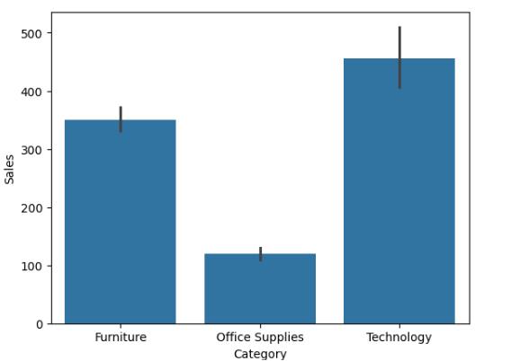
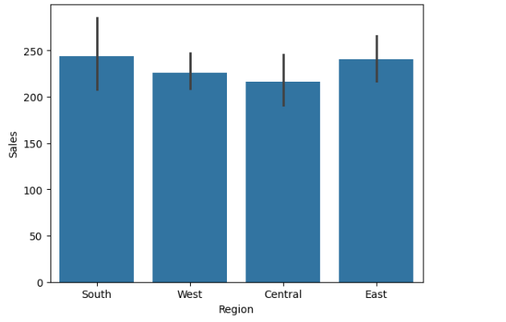

# SALES-DATA-ANALYSIS
## Overview
Analyzed sales data using Python to identify trends, top-performing products, and key business insights.

## Objectives
- Analyze sales performance across products and regions
- Identify top and low-performing products
- Understand sales trends over time

## Tools & Technologies
- Python (Pandas, NumPy)
- Matplotlib, Seaborn
- Jupyter Notebook

## Key Steps
- Data cleaning and preprocessing
- Exploratory Data Analysis (EDA)
- Trend and performance analysis

## Key Insights
- Identified top-performing products contributing maximum revenue
- Detected low-performing products impacting overall sales
- Observed monthly trends and seasonal patterns

## Files
- sales_analysis.ipynb — Main analysis notebook  
- data.csv — Dataset used  

## Conclusion
This project highlights how data analysis can help businesses make informed decisions by identifying performance trends and opportunities for growth.

## Visualizations

### Sales by Category

### Sales by Region

